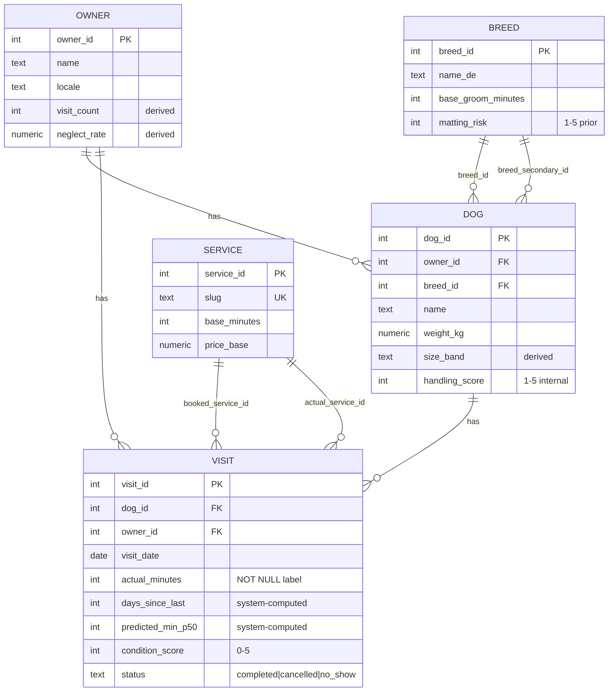

# Data model

Canonical schema for MuttMetrics. SQLAlchemy models live in `src/muttmetrics/models/`; Alembic migrations (#8) will materialize this in Postgres.

**Design split:** [ADR-001](./adr/001-derived-fields.md) — hand-entered vs derived vs system-computed-at-write columns.

## Entity relationships

**Navigation path:** `owner.dogs` → `dog.visits` (and `owner.visits` for direct owner-level queries).

## Tables

| Table | Role | Key relationships |
|-------|------|-------------------|
| `owner` | Slow-changing client (human). Behavioural aggregates. | → many `dog`, many `visit` |
| `dog` | Slow-changing physical + temperament priors per pet. | → `owner`, → `breed` (×2 for mixes), → many `visit` |
| `visit` | **Fact table** — one row per groom; training labels live here. | → `dog`, `owner`, → `service` (booked + actual) |
| `breed` | Reference priors for cold start (coat, duration, matting risk). | ← `dog.breed_id`, `dog.breed_secondary_id` |
| `service` | Reference groom types (slug, minutes, **price floor**). | ← `visit.booked_service_id`, `visit.actual_service_id` |

## Column groups (by table)

### `owner`

| Group | Columns |
|-------|---------|
| Hand-entered | `name`, `phone`, `email`, `locale`, `address_area`, `preferred_channel`, `client_since`, `notes` |
| Derived (recompute job) | `visit_count`, `avg_rebook_days`, `neglect_rate`, `cancellation_rate`, `no_show_count`, `avg_tip_pct`, `lifetime_value`, `reliability_score` |

### `dog`

| Group | Columns |
|-------|---------|
| Identity | `owner_id`, `name`, `breed_id`, `breed_secondary_id`, `sex`, `date_of_birth`, `weight_kg` |
| Coat | `coat_type`, `hair_or_fur`, `coat_density`, `undercoat`, `sheds` |
| Temperament (internal) | `handling_score`, `fear_triggers[]`, `muzzle_required`, `two_person_job`, `temperament_notes` |
| Medical | `skin_conditions[]`, `senior_flag`, `mobility_notes`, `vet_notes` |
| Derived (recompute job) | `size_band`, `visit_count`, `avg_duration_min`, `duration_stddev_min`, `typical_interval_days`, `last_visit_date`, `next_due_date` |

### `visit`

| Group | Columns |
|-------|---------|
| Identity | `dog_id`, `owner_id`, `visit_date` |
| Booking | `booked_service_id`, `booking_channel`, `is_emergency`, `intake_photos[]`, `quoted_price` |
| System-computed at write | `days_since_last`, `predicted_min_p50`, `predicted_min_p90` |
| Intake | `condition_score`, `matting_locations[]`, `fleas_or_parasites`, `arrived_wet_dirty` |
| Outcome | `actual_service_id`, `pivoted`, `pivot_reason`, `shaved_down`, `actual_minutes`, `final_price`, `tip`, `add_ons[]` |
| Qualitative | `what_surprised_me`, `behaviour_this_visit`, `after_photos[]` |
| Status | `status`, `cancelled_hours_before` |

### `breed` / `service`

Reference tables only — no FKs to other entities. See model files for full column lists.

## Implementation notes

- **Arrays:** list fields use Postgres `ARRAY(Text)`, not JSON (`fear_triggers`, `matting_locations`, photo URL lists, etc.).
- **CHECK constraints** (initial migration #8): `dog.handling_score` 1–5; `visit.condition_score` 0–5; `visit.behaviour_this_visit` 1–5; `visit.status` ∈ `completed`, `cancelled`, `no_show`. Postgres rejects invalid values even if application code bugs — e.g. `condition_score = 99` fails with `ck_visit_condition_score`.
- **Query indexes** (migration `bba4e6f67c96`, issue #9): FK columns on `dog` and `visit`, plus `visit.visit_date` — for owner/dog listings, visit history, day packing, and service-mix queries.
- **Required columns:** `owner.name`, `dog.name`, `visit.visit_date`, `visit.actual_minutes`.
- **Service prices:** `service.price_base` is a catalog **floor / placeholder** (seed). Size bands live on `dog`; on-the-spot charge on `visit.quoted_price` / `final_price` / `tip`.
- **Migrations:** Alembic — `alembic upgrade head` applies schema. See [`CONTRIBUTING.md`](../CONTRIBUTING.md).
- **Seed:** `python -m muttmetrics.seed` upserts breeds + services (idempotent).

### Indexes (issue #9)

| Index | Table | Column | Query path |
|-------|-------|--------|------------|
| `ix_dog_owner_id` | dog | `owner_id` | List dogs per owner |
| `ix_dog_breed_id` | dog | `breed_id` | Breed analytics |
| `ix_dog_breed_secondary_id` | dog | `breed_secondary_id` | Mix breeds |
| `ix_visit_dog_id` | visit | `dog_id` | Dog visit history; recompute dog stats |
| `ix_visit_owner_id` | visit | `owner_id` | Owner visit history; recompute owner stats |
| `ix_visit_visit_date` | visit | `visit_date` | Day view, date-range filters |
| `ix_visit_booked_service_id` | visit | `booked_service_id` | Booked service mix |
| `ix_visit_actual_service_id` | visit | `actual_service_id` | Actual outcome / pivot analysis |

## Source

| Model | File |
|-------|------|
| `Owner` | `src/muttmetrics/models/owner.py` |
| `Dog` | `src/muttmetrics/models/dog.py` |
| `Visit` | `src/muttmetrics/models/visit.py` |
| `Breed` | `src/muttmetrics/models/breed.py` |
| `Service` | `src/muttmetrics/models/service.py` |
